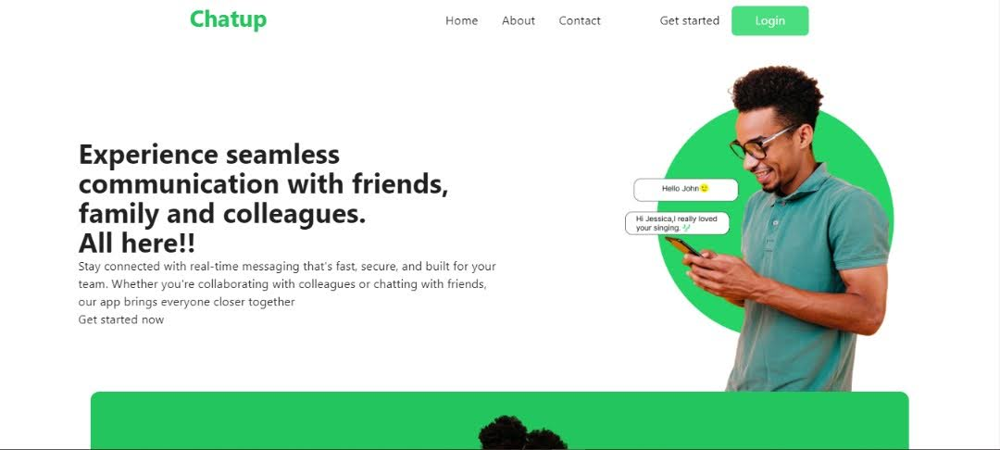

# Chatup 


<br>

**Chatup** is a Messaging and CRM Web Application. It is developed to easy and track Conversation between friends and family. This project is built using React.js and Node.js.
<br>




## Table of Content
1. [Features](#features)
2. [Installation](#installation)
3. [Usage](#usage)
4. [Configuration](#contribution)
5. [Contribution](#contribution)
6. [License](#license)
7. [Acknowledgement](#acknowledgement)

## Features
- **User:** Registration and Role based User management
- **Reporting:** Report submission and generations through a role based
- **Consignments:** Consigment of Ministry Activities to a registered partners
- **Online Library:** Public online library with thousands of ministry programs.

<br>


### Setup
1. Clone the repository:
    ```bash
    git clone https://github.com/josephakaro/Chatup.git
    cd Chatup
    ```

2. Install dependencies:
    ```bash
    npm install
    ```

3. Configure enivronment variables:
    - Rename `.env.example` to `.env.local` and update the value from supabase
    ```bash
    NEXT_PUBLIC_SUPABASE_URL=<YOUR_SUPABASE_URL>
    NEXT_PUBLIC_SUPABASE_ANON_KEY=<YOUR_SUPABASE_ANON_KEY>
    ```

4. Run database migrations:
    ```bash
    npx prisma migrate dev
    ```

5. Start the application:
    ```bash
    # This will reload on update with nodmen
    npm run dev

    # This will start the main application and will require manual reload
    npm start
    ```

## Usage
- **Frontend:** Access the application at [http://localhost:500](http://localhost:5000).
- **API:** Use the following endpoints to interact with the backend:
    - **Book Report**
    - `POST /api/auth/register`: Registration with email
    - `POST /api/auth/login`: Logging in with email`
    - `POST /api/auth/google`: Logging in with google
    - `POST /api/auth/logout`: Logging out
    - `GET /api/users/profile`: User Profile
    - `PUT /api/users/profile`: User Profile
    - `POST /api/groups`: Creating group
    - `POST /api/groups/:groupId`: Group details
    - `POST /api/groups/:groupId/members`: Adding Members to Group
    - `DELETE /api/groups/:groupId/members`: Removing Members from Group
    - `DELETE /api/groups/:groupId`: Group deleting
    - `POST /api/message/private`: Private messaging`
    - `POST /api/message/group`: group messaging`
    - `GET /api/message/private/:recipientId`: Private recipient
    - `GET /api/message/group/:groupId`: Group messaging

### Testing:
To run tests:

    ```bash
    npm run test
    ```

## Configuration
This project uses the following configuration files
- **.env.local :** Contains enivronment-specific variables
- **config.json :** Configurations for different environments (development, testing, productions)

Update these files as neccessary to match your enironment settings.

## Contribution
To Contribute to this project, please follow these steps:
1. Fork the repository
2. Create a new feature branch (`git checkout -b feature-brach-name`).
3. Commit your changes (`git commit -m 'Add some features`).
4. Push to the branch(`git push origin feature-branch-name`).
5. Create a new Pull Request

## License
This project is licensed under the [ONEHOPE License](/LICENSE)

## Acknowledgement
- **Supabase:** Complete backend resource and Database
- **Next.js:** Front-end developements
- **Node.js:** Backend Development
- **Prisma:** Database ORM mapping
- **Contributors:** [Joseph Akaro](https://josephakaro.tech)
                    [Destiny Onyiyo](https://github.com/Destiny-Kay)
                    [Abdullahi Abdulrofiu](https://github.com/credmighty)
                    [Ayoola Nuatin](https://github.com/nuatin)

<br>
B

[BACK TO TOP](#tesfa)
